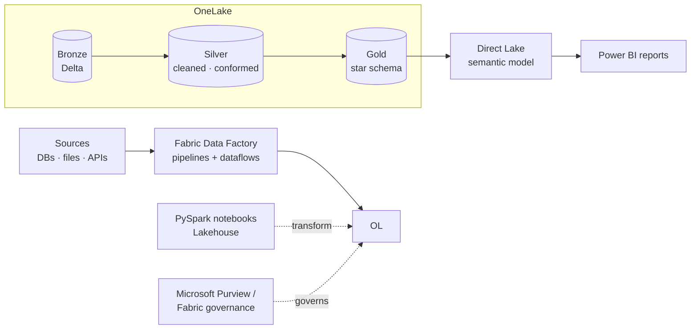

# Enterprise Lakehouse on Microsoft Fabric

> A unified, governed lakehouse — ingestion to semantic model — on Microsoft Fabric · **~2026** · Microsoft Fabric

**Role:** Data & AI Platform Architect
**Type:** Portfolio case study — architecture & approach are representative; production code is proprietary.

---

## Context

Organizations standardizing on the Microsoft estate want one platform that spans ingestion, lakehouse engineering, warehousing, BI and governance — without stitching together separate services. **Microsoft Fabric** offers exactly that, with **OneLake** as a single logical data lake and **Direct Lake** giving Power BI warehouse-speed reads straight off Delta.

This project (**circa 2026**) implements an enterprise lakehouse on Fabric: **Data Factory** pipelines land data into **OneLake**, **PySpark notebooks** build a **medallion** model, and a **Direct Lake semantic model** serves governed **Power BI** reporting. It deliberately **mirrors my Databricks medallion work** to demonstrate fluency on **both** leading lakehouse platforms — my second current headline strength, and the latest stage of my journey.

## Architecture

## Tech stack

- **Platform:** Microsoft Fabric (unified SaaS analytics)
- **Lake:** OneLake (single logical lake, Delta/Parquet, shortcuts)
- **Ingestion:** Fabric Data Factory (pipelines, dataflows Gen2)
- **Engineering:** Fabric Lakehouse + PySpark notebooks, Spark SQL
- **Serving:** Direct Lake semantic model, Power BI
- **Warehouse (as needed):** Fabric Warehouse (T-SQL)
- **Governance:** Unity-of-governance via Fabric / Microsoft Purview
- **Architecture:** Medallion (Bronze / Silver / Gold)

## Data model & architecture

- **Medallion in OneLake** — Bronze (raw Delta) → Silver (cleaned, conformed, deduplicated) → Gold (dimensional **star schema**), all as Delta tables in one lake.
- **Direct Lake semantic model** — the Gold star schema is exposed through a semantic model that reads Delta directly: import-like performance without import-time refresh or data duplication.
- **OneLake shortcuts** — reference existing data in place (including across clouds) instead of copying, reducing duplication and movement.

## Key design decisions

- **One lake, one copy** — OneLake + shortcuts avoid the copy-sprawl of multi-service stacks; data is referenced, not replicated.
- **Direct Lake over import/DirectQuery** — chosen for fresh, fast Power BI without scheduled refresh load or query-time latency, with import as a fallback where modeling demands it.
- **Same medallion discipline as Databricks** — Bronze/Silver/Gold and star-schema modeling carry over, so the platform changes but the architecture rigor doesn't.
- **Govern centrally** — workspace/domain governance and lineage so a SaaS platform stays enterprise-compliant.
- **Platform-portable patterns** — modeling kept tool-agnostic enough to reason about Fabric and Databricks side by side.

## Outcome & impact

- **Unified platform** — ingestion, engineering, warehousing and BI in one governed environment, cutting integration overhead.
- **Fast, fresh BI** — Direct Lake delivers near-real-time Power BI without refresh windows or data duplication.
- **Less data movement** — OneLake shortcuts reference data in place across the estate.
- **Demonstrated dual-platform depth** — a Fabric implementation that parallels my Databricks lakehouse, showing strength on both.

## Where this sits in my journey

Part of my **Data & AI Platform Architect** portfolio — the **~2026 Microsoft Fabric** stage, the most recent step and the second of my two current headline strengths (with Databricks GenAI).

⏮ prev: [financial-research-rag-databricks-genai](https://github.com/kamalakarpeta/financial-research-rag-databricks-genai) · ⏭ next: _(latest — to be continued)_
Full journey: https://kamalakarpeta.github.io

## Contact

LinkedIn: https://www.linkedin.com/in/kamalakarpeta/
