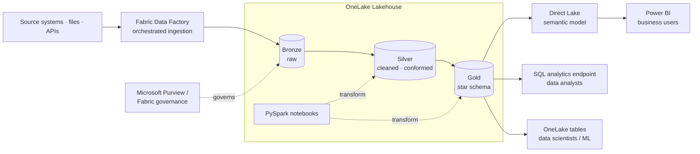

# Enterprise Lakehouse on Microsoft Fabric

> A unified, governed lakehouse that serves BI users, analysts and data scientists from one copy of data · **2026 (present)** · Microsoft Fabric

**Role:** Data & AI Platform Architect · *(2025–present — current role)*
**Type:** Portfolio case study — architecture & approach are representative; production code is proprietary.

---

## Context

Business stakeholders, **data analysts and data scientists** all needed trustworthy, current data — but were pulling from disconnected warehouses, extracts and one-off models, each with its own copy and its own version of the truth.

This project (**2026, present focus**) is a **data engineering** build on **Microsoft Fabric**: ingest with **Data Factory**, land and refine in **OneLake** as a **medallion** lakehouse using **PySpark notebooks**, and serve a single governed **Gold** layer to every consumer — **Power BI** users via a **Direct Lake** semantic model, analysts via SQL, and data scientists via the same OneLake tables. It deliberately mirrors my Databricks lakehouse work to show I deliver the same engineering outcomes on **both platforms** — and it is one of my two current headline strengths, alongside Databricks GenAI.

## Architecture

## Tech stack

- **Platform:** Microsoft Fabric
- **Storage:** OneLake (single logical lake; shortcuts to existing sources)
- **Ingestion / orchestration:** Fabric Data Factory pipelines
- **Processing:** PySpark notebooks, Spark; Delta/Parquet tables
- **Architecture:** Medallion (Bronze / Silver / Gold)
- **Serving:** Direct Lake semantic model → Power BI; SQL analytics endpoint; OneLake tables for DS/ML
- **Governance:** Fabric / Purview (lineage, sensitivity, access)

## Data model & architecture

- **Medallion in OneLake** — Bronze (raw) → Silver (cleaned, conformed) → **Gold star schema** (facts + conformed dimensions), one copy serving all engines.
- **Direct Lake semantic model** — Power BI reads Gold Delta tables directly from OneLake (no import, no separate extract), so BI users get warehouse-fresh data without a duplicated dataset.
- **Multi-consumer interface** — the same Gold tables are exposed three ways: semantic model (BI), SQL endpoint (analysts), OneLake tables (data scientists/ML) — engineered once, consumed by all.
- **Shortcuts over copies** — OneLake shortcuts reference existing data in place instead of re-ingesting it.

## Key design decisions

- **One copy, many consumers** — OneLake + Direct Lake removes the extract/import sprawl, so every downstream user reads the same governed Gold data.
- **Direct Lake over import** — chosen so Power BI stays current with the lakehouse without refresh cycles or duplicated storage.
- **Star schema as the serving contract** — dimensional Gold gives analysts and BI predictable, performant, self-service access.
- **Platform-parallel by design** — same medallion + governance outcomes as my Databricks builds, demonstrating both stacks rather than betting on one.

## Outcome & impact

- **Single source of truth** — BI users, analysts and data scientists consume one governed Gold layer instead of divergent copies.
- **Fresh BI without ETL sprawl** — Direct Lake keeps Power BI current straight off OneLake.
- **Self-service for every consumer** — semantic model, SQL endpoint and OneLake tables serve each downstream audience natively.
- **Both-platform credibility** — equivalent lakehouse engineering delivered on Microsoft Fabric and Databricks.

## Where this sits in my journey

Part of my **Data & AI Platform Architect** portfolio — the **2026 (present) Microsoft Fabric** stage, one of my two current headline strengths.

⏮ prev: [financial-research-rag-databricks-genai](https://github.com/kamalakarpeta/financial-research-rag-databricks-genai) · ⏭ next: _(latest — current focus)_
Full journey: https://kamalakarpeta.github.io

## Contact

LinkedIn: https://www.linkedin.com/in/kamalakarpeta/
